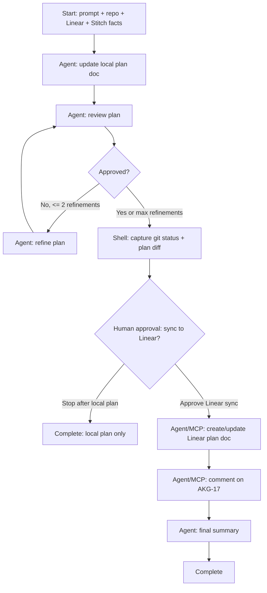

# Stitch Fast-Iteration Plan Process

```mermaid
flowchart TD
    A[Start: prompt + repo + Linear + Stitch facts] --> B[Agent: update local plan doc]
    B --> C[Agent: review plan]
    C --> D{Approved?}
    D -- No, <= 2 refinements --> E[Agent: refine plan]
    E --> C
    D -- Yes or max refinements --> F[Shell: capture git status + plan diff]
    F --> G{Human approval: sync to Linear?}
    G -- Stop after local plan --> H[Complete: local plan only]
    G -- Approve Linear sync --> I[Agent/MCP: create/update Linear plan doc]
    I --> J[Agent/MCP: comment on AKG-17]
    J --> K[Agent: final summary]
    K --> L[Complete]
```
