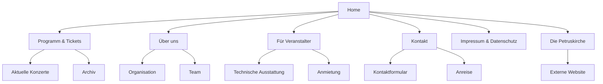
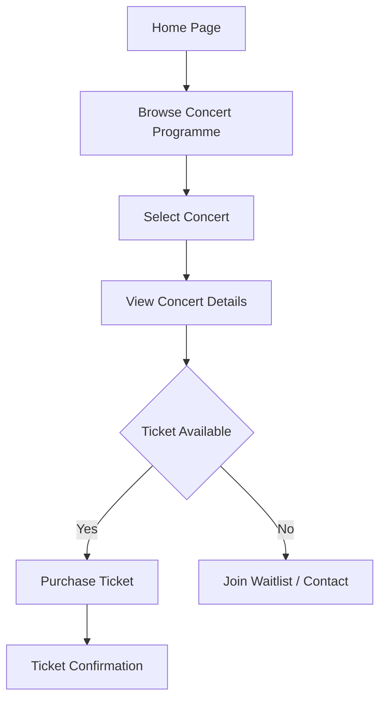
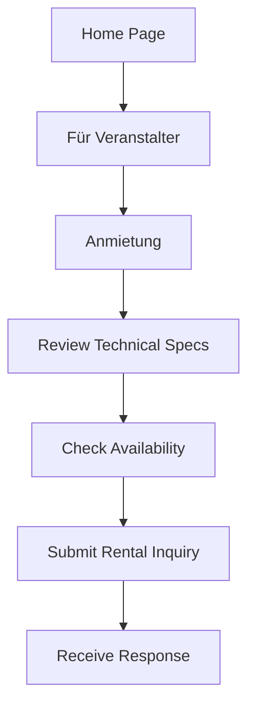

# Site Architecture: Konzerte in der Petruskirche

> **Status**: Completed (AKG-16)
> **Date**: January 20, 2026
> **Document**: [Site Architecture in Linear](https://linear.app/akg-kiel/document/site-architecture-concert-landing-page-92dab011d41b)

## Overview

This document outlines the comprehensive site architecture for the "Konzerte in der Petruskirche" landing page, addressing the needs of both concert attendees and event hosts.

## Target Audiences

### 1. Concert Attendees
Primary users looking for:
- Upcoming concert information
- Ticket purchasing options
- Venue basics and accessibility
- Artist information
- Event history

### 2. Event Hosts
Secondary users interested in:
- Venue rental information
- Technical specifications
- Rental pricing and availability
- Contact and booking process
- Capacity and amenities

## Site Structure

### Navigation Hierarchy

### User Flow: Buying Tickets

### User Flow: Venue Rental Inquiry

## Page Content Structure

### 1. Home Page (`/`)

**Sections:**
- Hero with current/upcoming concert highlight
- Quick access to ticket purchase
- Latest announcements
- Upcoming concerts preview (3-4)
- Brief about section
- Link to external church website (footer or secondary section)
- Contact CTA
- Footer with navigation

**Key Elements:**
- Mobile-optimized hero with high-impact imagery
- Clear call-to-action for tickets
- Responsive concert cards with date, artist, and venue info
- Sticky navigation on scroll
- Link to external church website

### 2. Programme & Tickets (`/programm`)

**Sub-sections:**
- Current/Upcoming concerts
- Concert archive
- Season overview

**Content:**
- Full concert schedule with dates, times, and programs
- Artist bios and program notes
- Pricing information
- Ticket purchase links/buttons
- Accessibility information for each venue
- Brief venue location info

### 3. About Us (`/ueber-uns`)

**Content Sections:**
- Organization overview
- Mission and values
- Team members
- History of concert series
- Partners and supporters

### 4. For Event Hosts (`/fuer-veranstalter`)

**Sub-sections:**

#### a) Technical Specifications (`/fuer-veranstalter/technik`)
- Sound system details
- Lighting capabilities
- Stage dimensions
- Equipment rental policies
- Load-in/load-out procedures

#### b) Venue Rental (`/fuer-veranstalter/anmietung`)
- Rental pricing
- Availability calendar
- Rental terms and conditions
- Technical requirements
- Insurance requirements

### 5. Contact (`/kontakt`)

**Content:**
- Contact form
- Contact information (phone, email, address)
- Map integration
- Directions and public transport
- Parking information
- Accessibility directions

### 6. External Link: The Petruskirche

**Navigation Item:**
- External link to separate church website
- Opens in new tab with appropriate rel attributes

### 7. Legal Pages

#### Impressum (`/impressum`)
- Legal information as required by German law
- Contact details
- VAT information
- Publisher information

#### Privacy Policy (`/datenschutz`)
- Data collection and processing
- Cookie policy
- User rights under GDPR
- Contact for privacy concerns

## URL Structure (SEO-Friendly)

- `/` - Home
- `/programm` - Current concert programme
- `/programm/archiv` - Past concerts archive
- `/ueber-uns` - About organization
- `/ueber-uns/team` - Team members
- `/fuer-veranstalter` - For event hosts overview
- `/fuer-veranstalter/technik` - Technical specifications
- `/fuer-veranstalter/anmietung` - Venue rental
- `/kontakt` - Contact form
- `/impressum` - Legal notice
- `/datenschutz` - Privacy policy

## Mobile Navigation Strategy

### Primary Navigation (All Screens)
- Home
- Programm
- Über uns
- Für Veranstalter
- Kontakt

### Mobile Considerations

1. **Hamburger Menu**: For screens < 768px
   - Full-screen overlay menu
   - Clear visual hierarchy
   - Easy tap targets (min 44px height)

2. **Sticky Header**: Always visible
   - Logo on left
   - Hamburger on right
   - Quick access to "Tickets" button

3. **Bottom Navigation Bar** (Optional): For quick access
   - Home icon
   - Programme icon
   - Ticket purchase button (highlighted)
   - Contact icon

4. **Footer**: Collapsible on mobile
   - Essential links visible
   - External church link prominent
   - Legal links accessible via expand

## Content Hierarchy & IA Principles

### Information Architecture Principles

1. **Task-Based Navigation**: Primary tasks first (find concerts, buy tickets)
2. **Audience Segmentation**: Clear paths for different user types
3. **Progressive Disclosure**: Detailed information only when needed
4. **Consistent Navigation**: Predictable menu structure across pages
5. **Visual Hierarchy**: Clear distinction between primary and secondary content

### Content Priority

1. **High Priority** (Always visible/accessible):
   - Upcoming concerts
   - Ticket purchase
   - Contact information

2. **Medium Priority** (One click away):
   - Artist information
   - Organization info
   - Event host information (Für Veranstalter)

3. **Low Priority** (Footer/secondary navigation):
   - Legal pages
   - Archive
   - External church link

## Technical Considerations

### Static Site Architecture (Astro)

- All pages as static `.astro` files
- No dynamic routing in initial phase
- Content managed through component props or JSON
- Optimized for Cloudflare Workers static hosting

### Performance Optimization

- Lazy load images below fold
- Minimal JavaScript (only for interactive components)
- CSS bundling for optimal delivery
- Responsive images with proper sizing

### Accessibility (WCAG AA Compliance)

- Semantic HTML structure
- ARIA labels for interactive elements
- Keyboard navigation support
- Screen reader optimization
- Color contrast compliance
- Focus indicators

### External Links

- Church website link with `rel="noopener noreferrer"`
- Opens in new tab
- Clear visual indication of external link

## Next Steps

1. **Phase 1 - MVP**: Home, Programme, Contact
2. **Phase 2 - Expansion**: About, Für Veranstalter
3. **Phase 3 - Enhancement**: Archive, advanced features

## Related Tickets

- [AKG-16](https://linear.app/akg-kiel/issue/AKG-16) - Plan Site Architecture
- Future tickets for each page implementation

---

*Last Updated: January 20, 2026*
